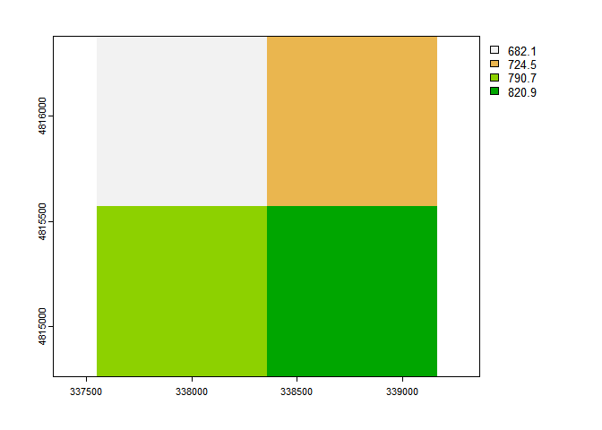

<!-- README.md is generated from README.Rmd. Please edit that file -->

# rusleR 

<!-- badges: start -->

[](https://github.com/atsyplenkov/rusleR/actions)
[](https://cran.r-project.org/package=rusleR)
[](/commits/master)
[](https://www.tidyverse.org/lifecycle/#experimental)
[](https://www.repostatus.org/#concept)

<!-- badges: end -->

This package offers an `R` implementation of Universal Soil Loss
Equation
([USLE](https://en.wikipedia.org/wiki/Universal_Soil_Loss_Equation)).
You can find here a collection of functions to estimate main factors:
R-factor, K-factor, LS-factor and C-factor. The package
uses[`terra`](https://github.com/rspatial/terra) and
[`Rsagacmd`](https://github.com/stevenpawley/Rsagacmd/) in the
background. [`SAGA GIS`](https://sourceforge.net/projects/saga-gis/)
need to be installed on your machine as well.

> **Disclaimer!** This package is under development right now. It was
> tested on Windows 10 only. However, its operability fully depends on
> `terra` and `Rsagacmd` packages. Therefore it is expected that
> `rusleR` should work on Linux-based machines as well.

## Installation

You can install the development version of rusleR from
[GitHub](https://github.com/) with:

``` r
# install.packages("devtools")
devtools::install_github("atsyplenkov/rusleR")
```

## Example

``` r
library(rusleR)
## basic example code
```

### LS-factor

This is a basic example which shows you how to calculate LS_alpine
([Schmidt et al.,
2019](https://www.sciencedirect.com/science/article/pii/S2215016119300056)):

``` r
library(Rsagacmd)
library(terra)

# initiate a saga object
saga <- saga_gis(raster_backend = "terra")

# load DEM
f <- system.file("extdata/dem.tif", package="rusleR")
DEM <- rast(f)

# calculate LS-alpine
ls <- ls_alpine(dem = DEM)
```

As a result of `ls_alpine()` you receive a `SpatRaster` object:

``` r
ls
#> class       : SpatRaster 
#> dimensions  : 78, 54, 1  (nrow, ncol, nlyr)
#> resolution  : 27.30756, 27.30756  (x, y)
#> extent      : 337615.4, 339090, 4814626, 4816756  (xmin, xmax, ymin, ymax)
#> coord. ref. : WGS 84 / UTM zone 38N (EPSG:32638) 
#> source      : memory 
#> name        : LSalpine 
#> min value   :        0 
#> max value   : 114.6034
```


### R-factor

With the help of `get_glored()` function you can quickly download and
crop to AOI a Global Rainfall Erosivity Database map
([GLORED](https://esdac.jrc.ec.europa.eu/content/global-rainfall-erosivity)).
It was created by [*Panagos et al.*
(2017)](https://www.nature.com/articles/s41598-017-04282-8) based on
*in-situ* measurements from 3,625 stations. This GLORED was used to
develop a global erosivity map at 30 arc-seconds(\~1 km) based on a
Gaussian Process Regression(GPR).

``` r
library(terra)

f <- system.file("extdata/extent.shp", package="rusleR")
v <- vect(f)

r_factor <- get_glored(v)
```

As a result of `get_glored()` you receive a `SpatRaster` object:

``` r
r_factor
#> class       : SpatRaster 
#> dimensions  : 2, 2, 1  (nrow, ncol, nlyr)
#> resolution  : 809.8197, 809.8197  (x, y)
#> extent      : 337544.9, 339164.5, 4814761, 4816381  (xmin, xmax, ymin, ymax)
#> coord. ref. : +proj=utm +zone=38 +datum=WGS84 +units=m +no_defs 
#> source      : memory 
#> name        :      out 
#> min value   : 682.1308 
#> max value   : 820.8951
```



## Citation

While `rusleR` does not redistribute the data or provide it in any way,
we encourage users to cite original papers when using this package. E.g.
to cite Panagos et al. (2017) when using GLORED, Hengl et al. (2017)
when using SoilGrids and Schmidt et al. (2019) when using
LS<sub>alpine</sub>:

> Panagos, Panos, Pasquale Borrelli, Katrin Meusburger, Bofu Yu, Andreas
> Klik, Kyoung Jae Lim, Jae E. Yang, et al. “Global Rainfall Erosivity
> Assessment Based on High-Temporal Resolution Rainfall Records.”
> Scientific Reports 7, no. 1 (June 23, 2017): 4175.
> <https://doi.org/10.1038/s41598-017-04282-8>.

> Hengl, Tomislav, Jorge Mendes de Jesus, Gerard B. M. Heuvelink, Maria
> Ruiperez Gonzalez, Milan Kilibarda, Aleksandar Blagotić, Wei
> Shangguan, et al. “SoilGrids250m: Global Gridded Soil Information
> Based on Machine Learning.” PLOS ONE 12, no. 2 (February 16, 2017):
> e0169748. <https://doi.org/10.1371/journal.pone.0169748>.

> Schmidt, Simon, Simon Tresch, and Katrin Meusburger. “Modification of
> the RUSLE Slope Length and Steepness Factor (LS-Factor) Based on
> Rainfall Experiments at Steep Alpine Grasslands.” MethodsX 6 (2019):
> 219–29. <https://doi.org/10.1016/j.mex.2019.01.004>.

## To-do list

-   [x] K-factor functions
-   [ ] tidy-loader disclaimer (see `tidyterra` package)
-   [ ] New radar-based R factor
    (<https://esdac.jrc.ec.europa.eu/themes/satellite-based-global-r-factor>)
-   [ ] SDR estimation (see [Batista et al.,
    2021](https://www.sciencedirect.com/science/article/pii/S1364815221000049))
-   [ ] Connectivity index (see [Borselli et al.,
    2008](https://www.sciencedirect.com/science/article/pii/S0341816208000982))
-   [ ] IC by [Cavalli et al.,
    2013](https://www.sciencedirect.com/science/article/pii/S0169555X12002267)
-   [ ] SDR by [Vigiak et al.,
    2012](https://www.sciencedirect.com/science/article/pii/S0169555X11004478)
-   [ ] C-factor????
